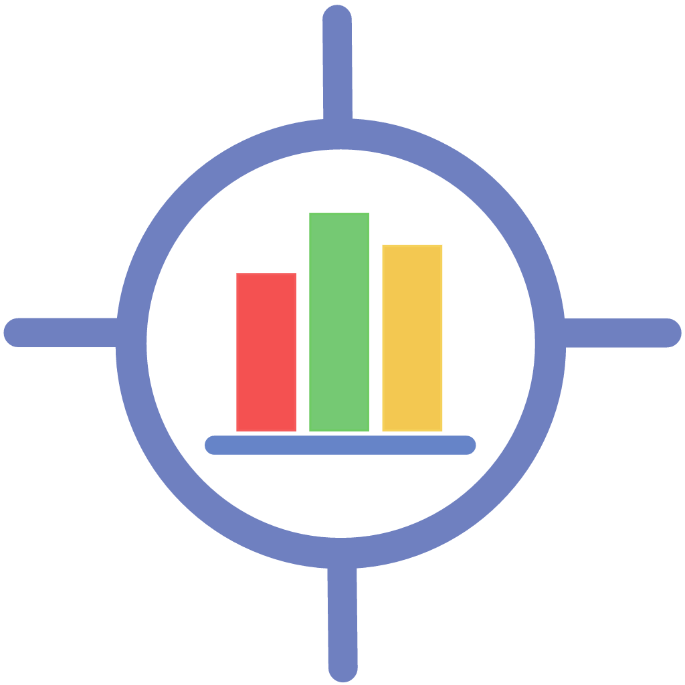

[Home](index)  | [News](News)  | [Gallery](gallery)  | [Privacy Policy](PrivacyPolicy)  | [Contact Us](contactus) 

# ProjectAble 

> A helpful status reporting and forecasting App for iPhone

           

## Current Version
Version 1.0.13 

## Table of contents
1. [What is ProjectAble?](#introduction)
2. [How does ProjectAble work?](#how)
3. [Lifecycle](#lifecycle)
4. [Earned Value (EVA) techniques](#ev)
5. [Notes](#notes)
6. [Privacy Policy](#privacy)

## 1. What is ProjectAble? 
ProjectAble uses a traditional project management technique called Earned Value Analysis to forecast the outcome of the project accurately and reliably.

## 2. How does ProjectAble work? 

:eyeglasses: [ProjectAble User Guide](https://snowyalcazar.github.io/ProjectAble/pdfs/UserGuide.pdf) 

### Setup 
To create a project, only 8 pieces of information are required. 
1. Project identifier
2. Sponsor's name
3. A description
4. How often you report on your project - select frequency from : daily, weekly, 2 weekly or 4 weekly
5. Project start date
6. Project end date
7. Project budget
8. Budget distribution - the 5 options available are described below.

### Treatment Of Time 
ProjectAble uses time only to calculate the project duration and number of reporting periods when a project is created. Each time a new progress update is added, ProjectAble calculates the budget percentage complete and spend for the reporting period (or uses the manual values provided). The reporting period is important but ProjectAble does not use specific date and time values in these calculations. With the final progress update, ProjectAble will set the percent complete to 100%. As with all progress updates, you can overwrite the pre-calculated values but please note, setting the percent complete to less than 100% will allow the project to continue, however, in these circumstances the calculations may behave unexpectedly.

### Budget Distribution  
ProjectAble uses the reporting frequency, project start and project end dates, and selected budget distribution curve input by the user when setting up the project, to spread the project budget according to expectated project spend and schedule. ProjectAble provides 5 methods for distributing budgets:

Curve | Description
------|------------
Flat | distributes the budget evenly across the reporting periods
Front | loads the majority of spend at the beginning of the project
Normal | loads the majority of spend in the middle of the project
Back | loads the majority of spend towards the end of the project
Manual | enables the user to create per reporting period budgets manually according to their planning

ProjectAble distributes the automated budget spreads by dividing the duration into quarters and applying a rate to each reporting period within each quarter in order to profile distribution as smoothly as possible. Setting budgets manually provides greater control over budget distribution.

> If the duration of a project allows less than 4 reporting periods, the curve will be treated as **flat**. This does not apply if the project is using the ***manual budget*** option.

### Project Lifecycle 

### Completing a project 
A project is set to complete automatically with the final reporting period or a project can be manually marked complete in 'Project Settings'. by clicking the button on the Project Details screen.

[Back to top...](#top)

## 3. Use of Earned Value (EVA) techniques 

ProjectAble uses the earned value calulations discussed widely on the web and published in the **Project Management Book of Knowledge (PMBoK)** [PMI EVA](https://www.pmi.org/learning/library/make-earned-value-work-project-6001). In addition, ProjectAble makes use of two additional Estimate AT Complete methods - [IEAC1 & IEAC2](https://www.linkedin.com/pulse/earned-value-management-ieac1-ieac2-mick-higgins/) which provide further context and provides a range in which the final project cost is currently forecast to fall.

Calculation | Method | Descriptive Method
------------|--------|-------------------
Planned Value (BCWS) | Planned PComp * BAC | Planned Percent Complete * Budget At Complete (original project budget)
Earned Value (BCWP) | PComp * BAC | Actual Percent Complete * BAC
Schedule Variance | EV - PV | Earned Value - Planned Value
Schedule Performance Index | EV / PV | Earned Value / Planned Value
Cost Variance | EV - AC | Earned Value - Actual Cost
Cost Performance Index | EV / AC | Earned Value / Actual Cost
Estimate At Complete | BAC / CPI | Project Budget / Cost Performance Index
IEAC1 (independent EAC1) | (AC + (BAC-EV)) / CPI | Actual Cost + (Budget Cost - Earned Value) / Cost Performance Index
IEAC2 (independent EAC2) | (AC + (BAC-EV)) / (CPI * SPI) | Actual Cost + (Budget Cost - Earned Value) / (Cost Performance Index * Schedule Performance Index)
Estimate To Complete | EAC - AC | Estimate At Complete - Actual Cost (to date)
To Complete Project Index | (BAC - EV) / (BAC - AC) | (Budget Cost - Earned Value) / (Budget Cost - Actual Cost)

## Notes 
- ProjectAble **_is_** a helpful tool to enable project professionals to track the status and forecast of a project quickly, reliably and accurately
- ProjectAble **_is not_** intended to replace good planning, estimation, monitoring or control processes. Other tools are available for those purposes.

## Privacy Policy 
- ProjectAble does not collect any personal data
- ProjectAble does not share any personal data
- All data entered in or created by ProjectAble is stored in local database on the users device

[Back to top...](#top)

